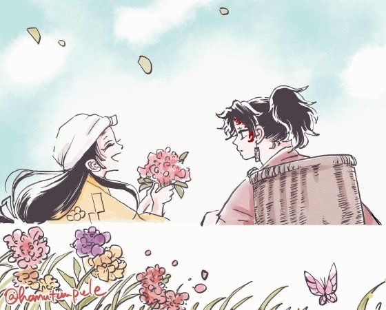

$\large\color{	#FF007F}\texttt{{"No matter what happens we are always bonded."}}$

       $\small {\texttt{𐙚 mimi >> ᶻ 𝗓 𐰁 .ᐟ hyper and senstive!ᥫ᭡.}}$

  
<!--
**mimivii/mimivii** is a ✨ _special_ ✨ repository because its `README.md` (this file) appears on your GitHub profile.
Here are some ideas to get you started:

- 🔭 I’m currently working on ...
- 🌱 I’m currently learning ...
- 👯 I’m looking to collaborate on ...
- 🤔 I’m looking for help with ...
- 💬 Ask me about ...
- 📫 How to reach me: ...
- 😄 Pronouns: ...
- ⚡ Fun fact: ...
-->
